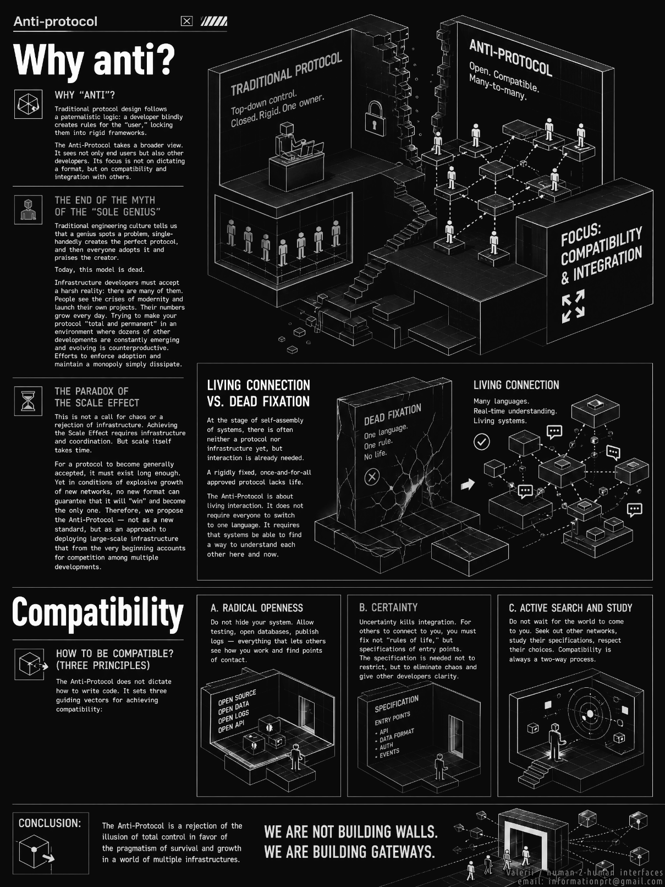

# Anti-Protocol
/Self-Coordination at Unlimited Scale/

*02 Apr 2026 / informationprt(at)gmail.com*

# Why anti?

Traditional protocol design follows a paternalistic logic: a developer blindly creates rules for the “user,” locking them into rigid frameworks.

The Anti-Protocol takes a broader view. It sees not only end users but also other developers. Its focus is not on dictating a format, but on compatibility and integration with others.

## The End of the Myth of the “Sole Genius”
Traditional engineering culture tells us that a genius spots a problem, single-handedly creates the perfect protocol, and then everyone adopts it and praises the creator.

Today, this model is dead.

Infrastructure developers must accept a harsh reality: there are many of them. People see the crises of modernity and launch their own projects. Their numbers grow every day. Trying to make your protocol “total and permanent” in an environment where dozens of other developments are constantly emerging and evolving is counterproductive. Efforts to enforce adoption and maintain a monopoly simply dissipate.

## The Paradox of the Scale Effect
This is not a call for chaos or a rejection of infrastructure. Achieving the Scale Effect requires infrastructure and coordination. But scale itself takes time.

For a protocol to become generally accepted, it must exist long enough. Yet in conditions of explosive growth of new networks, no new format can guarantee that it will “win” and become the only one. Therefore, we propose the Anti-Protocol — not as a new standard, but as an approach to deploying large-scale infrastructure that from the very beginning accounts for competition among multiple developments.

## Living Connection vs. Dead Fixation
At the stage of self-assembly of systems, there is often neither a protocol nor infrastructure yet, but interaction is already needed.

A rigidly fixed, once-and-for-all approved protocol lacks life. The Anti-Protocol is about living interaction. It does not require everyone to switch to one language. It requires that systems be able to find a way to understand each other here and now.

# How to Be Compatible? (Three Principles)
The Anti-Protocol does not dictate how to write code. It sets three guiding vectors for achieving compatibility:

**A. Radical Openness.**
Do not hide your system. Allow testing, open databases, publish logs — everything that lets others see how you work and find points of contact.

**B. Certainty.**
Uncertainty kills integration. For others to connect to you, you must fix not “rules of life,” but specifications of entry points. The specification is needed not to restrict, but to eliminate chaos and give other developers clarity.

**C. Active Search and Study.**
Do not wait for the world to come to you. Seek out other networks, study their specifications, respect their choices. Compatibility is always a two-way process.

### Conclusion:

The Anti-Protocol is a rejection of the illusion of total control in favor of the pragmatism of survival and growth in a world of multiple infrastructures. We are not building walls. We are building gateways.
